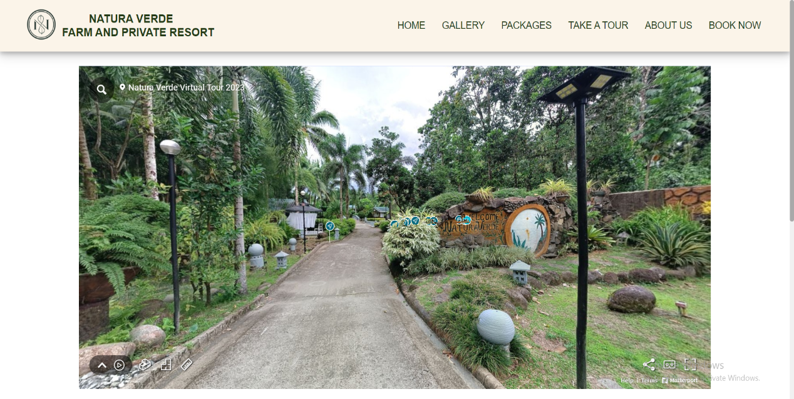
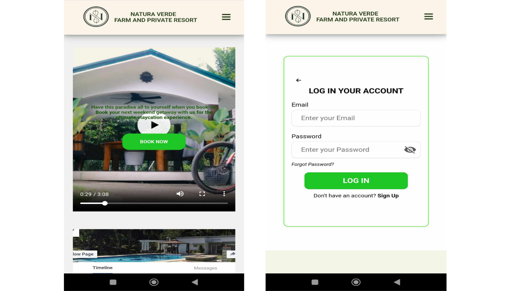

# Resort Web-based Reservation Management System 

## Project Description
The system offers an intuitive and user-friendly website that provides comprehensive information about the resort, a seamless and efficient reservation management system, and an engaging virtual tour of the resort. It was developed to modernize the reservation process, transitioning from a manual system to a fully automated one, ensuring greater efficiency and accuracy. Additionally, the system aims to enhance the overall quality of service and boost customer satisfaction, creating a more enjoyable and hassle-free experience for guests

## Project Structure
The project is organized into the following directories:

- **CSS**: Contains the stylesheet files for the website.
- **PHP**: Includes any backend PHP scripts used (if any).
- **Resources**: Holds images, icons, and other media resources.
- **SQL**: Contains any SQL scripts used for database setup.

## Features
- **Promotional Website**: The website features a gallery showcasing the resort’s offerings, including images of rooms, the swimming pool, parking lot, function hall, resort amenities, green spaces, seasonal fruits, and event setups. This allows users to get a visual preview of what the resort has to offer.

- **Virtual Tour**: Users can explore the resort remotely with an interactive virtual tour that covers areas like the entrance, rooms with attached comfort rooms, parking lot, function hall, pool, and half basketball court. The experience is enhanced with on-screen text indicating the user’s current location and a video with audio narration providing detailed descriptions of each space.
 

- **Responsive Design**: The website is built with a responsive user interface that adjusts its layout and content structure seamlessly across different devices. This ensures a smooth and accessible browsing experience on both desktop and mobile platforms.

- **GCash and PayPal Payment**: The reservation management system integrates online payment options, offering users the convenience of choosing between GCash and PayPal. Users can opt to make a half-payment as a down payment or pay the full price for their reservation. This feature streamlines the booking process by providing flexible and secure payment choices. By catering to diverse preferences, this payment integration enhances the accessibility and user-friendliness of the reservation system, ensuring a seamless and accommodating transaction experience.

- **Automated Emails**: The system includes an automated email feature to enhance communication and efficiency. Users will receive email notifications sent to the address they provide for various actions, such as reservation confirmations, cancellations, and account verification during registration. This ensures prompt and reliable communication at every stage of their interaction.

- **Save PDF**: The website offers a "Save as PDF" function, allowing users to save their reservation details in a convenient and shareable format. This feature ensures users can easily store and access their booking information whenever needed.

- **QR Code**: Upon completing a reservation, the system generates a unique QR code for download. This QR code serves as proof of booking and is required during check-in. It includes essential details such as the client’s information, tour package, number of guests, check-in and check-out times, room details, and total rate, which can be quickly accessed when scanned.
  

## Developers
- [Aljonard B. Dela Cruz ](https://www.linkedin.com/in/aljonard-dela-cruz-69b052317/)
- [Johnrey V. Luntayao ](https://www.linkedin.com/in/johnrey-luntayao/)
- [Jenica J. Cabanela](https://www.linkedin.com/in/jenica-j-cabanela-92b5b72ab/)
